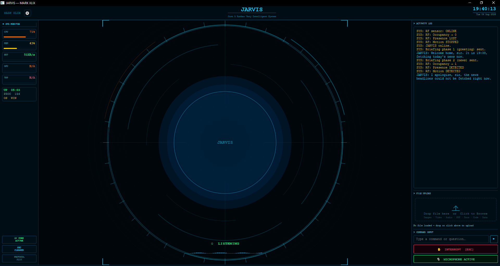
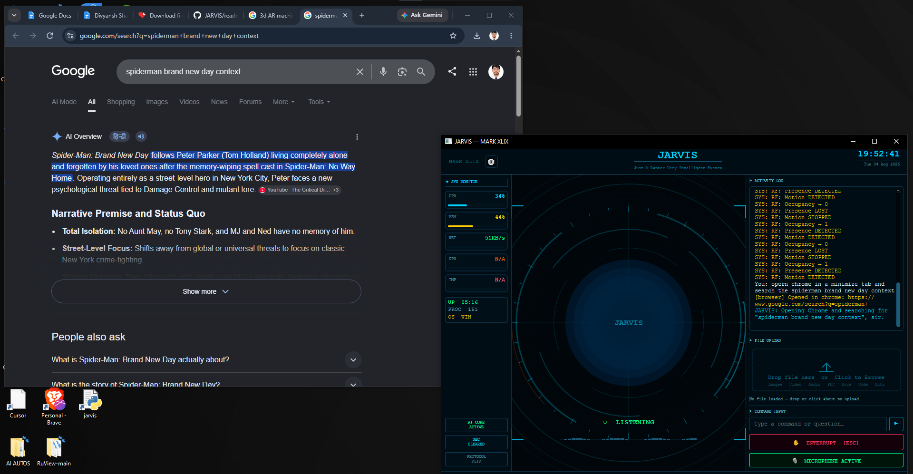
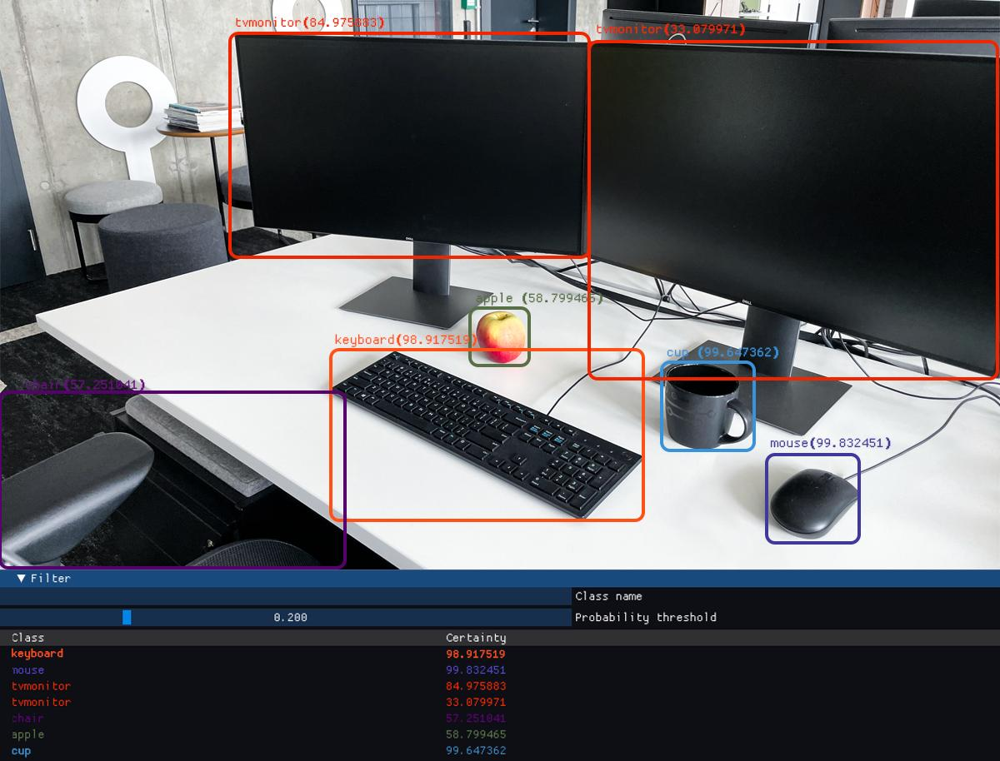
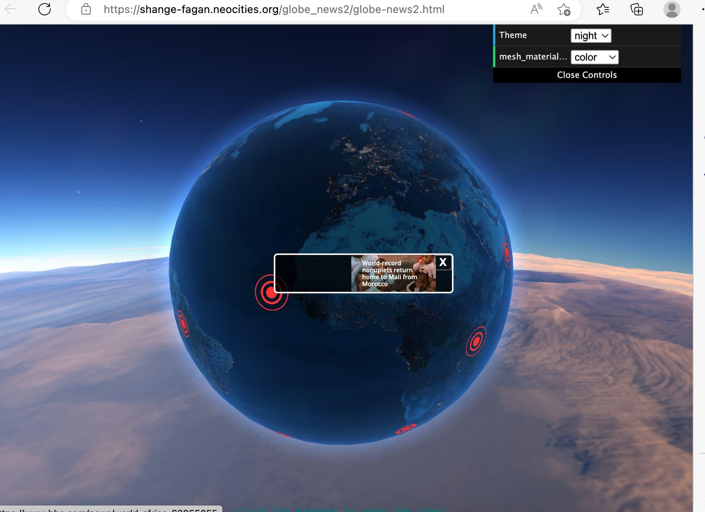
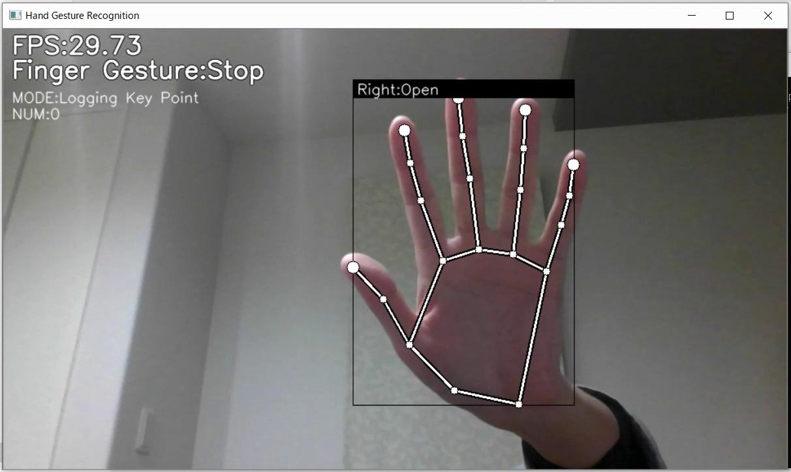
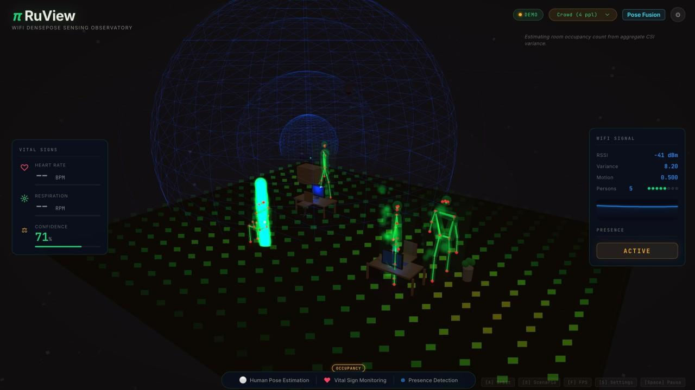

# ⚙️ J.A.R.V.I.S.
## Just A Rather Very Intelligent System

### Multimodal AI Desktop & Spatial Computing Assistant

<p align="center">
  
</p>

<p align="center">
  <b>Python • Machine Learning • Multimodal AI • Local & Web LLMs • Computer Vision • Agentic Automation • Spatial Computing</b>
</p>

---

## Overview

**J.A.R.V.I.S.** is a Python and Machine Learning-based multimodal AI agent designed to move beyond a conventional chatbot and operate as an intelligent interface between the user, the computer, and eventually the surrounding physical environment.

The current system combines **real-time voice interaction, web/cloud AI, computer vision, persistent memory, autonomous task execution, full desktop and browser control, file intelligence, web research, messaging, hardware telemetry, screen awareness, developer tools, reminders, and remote interaction**.

JARVIS is also being extended toward a hybrid **local + web LLM architecture** and a spatial-computing layer incorporating **interactive 3D/AR visualization, ML-based gesture and motion recognition, sensor fusion, and experimental RuView RF spatial sensing**.

> **Project status:** Active development. Features under development or research are explicitly labelled below and are not presented as completed functionality.

---

# ✨ Core Capabilities

| Capability | Description |
|---|---|
| 🎙️ **Real-Time Voice AI** | Low-latency conversational interaction and voice-command execution |
| 🧠 **Hybrid AI Architecture** | Web/cloud LLM intelligence with local LLM integration being developed |
| 👁️ **Visual Awareness** | Screen capture and webcam context for multimodal reasoning |
| 💾 **Persistent Memory** | Retains useful project, preference, and contextual information across sessions |
| 🧩 **Autonomous Tasks** | Agent-oriented execution of multi-step computer tasks |
| 🖥️ **Desktop Control** | Applications, keyboard/mouse, windows, shortcuts, system settings and desktop operations |
| 🌐 **Browser Control** | Browser launching, navigation and web-oriented automation |
| 🔍 **Web Research** | Search, research, news, price and comparison workflows |
| 📂 **File Intelligence** | Local file reading, processing, summarization and question answering |
| 📊 **Hardware Monitoring** | CPU, RAM, GPU and temperature/system telemetry |
| 📨 **Messaging** | Messaging integrations and automated communication actions |
| 💻 **Developer Tools** | Code review, debugging, generation and developer-agent workflows |
| ⏰ **Smart Reminders** | OS-native scheduled notifications |
| 📋 **Clipboard Intelligence** | Translate, summarize, explain and fix copied text |
| 🔔 **Proactive Assistance** | Context-aware check-ins after inactivity |
| 📱 **Remote Dashboard** | Remote assistant interaction through phone pairing |

---

# 🖥️ JARVIS MARK XLIX Interface

The current JARVIS interface provides a centralized HUD for voice interaction, system monitoring, task feedback, file input, command execution and activity logging.

<p align="center">
  
</p>

<p align="center">
  <i>Actual JARVIS MARK XLIX interface.</i>
</p>

The HUD exposes live system information while keeping the AI interaction layer continuously accessible. JARVIS can report its actions through the activity log while receiving commands through voice or text.

---

# 🖱️ Autonomous Desktop & Browser Control

JARVIS can translate natural-language instructions into desktop-level actions such as opening applications, interacting with windows, launching browser workflows and executing supported system operations.

<p align="center">
  
</p>

<p align="center">
  <i>Actual JARVIS execution: browser opened and a Google search triggered from a natural-language command.</i>
</p>

Examples of supported desktop-oriented operations include:

- Launching applications
- Browser opening and navigation
- Keyboard shortcuts
- Mouse and window operations
- Volume and brightness control
- Wi-Fi/system controls
- File-system operations
- YouTube playback control
- Messaging actions
- Scheduled reminders
- System and hardware monitoring

---

# 👁️ Computer Vision & Screen Awareness

JARVIS can use screen capture and webcam input as visual context for multimodal reasoning.

This creates the foundation for:

- Screen understanding
- Camera-based scene awareness
- Visual question answering
- Context-aware desktop actions
- Object and environment interpretation
- Combining voice instructions with visual information

### Computer-Vision Development Reference

<p align="center">
  
</p>

<p align="center">
  <i>Computer-vision reference demonstrating object detection and confidence-based classification. This image is a development/reference example, not a JARVIS UI screenshot.</i>
</p>

---

# 🧠 Local + Web LLM Intelligence

JARVIS is designed around a **hybrid AI architecture** rather than depending permanently on one model.

```text
                    USER
             Voice / Text / Vision
                      │
                      ▼
             ┌─────────────────┐
             │   JARVIS CORE   │
             │ Context + Tools │
             └────────┬────────┘
                      │
             ┌────────┴────────┐
             │                 │
             ▼                 ▼
      ┌─────────────┐   ┌─────────────┐
      │  WEB / API  │   │  LOCAL LLM  │
      │    LLMs     │   │   ENGINE    │
      └──────┬──────┘   └──────┬──────┘
             │                 │
             └────────┬────────┘
                      ▼
             Reasoning / Routing
                      │
                      ▼
        Desktop • Vision • Files • Web
```

### Web / Cloud Intelligence

Web/API-based multimodal models can provide high-level reasoning, conversation, visual understanding and tool orchestration.

### Local Intelligence

Local LLM support is being developed for selected workloads where on-device execution is useful.

The long-term architecture is intended to route workloads according to factors such as:

- Task complexity
- Model capability
- Available GPU/CPU resources
- Latency
- Network availability
- Privacy requirements

---

# 🧩 Modular Agent Architecture

JARVIS is not a single monolithic chatbot script. Core functions are separated into dedicated action modules.

```text
                           ┌──────────────────┐
                           │       USER       │
                           │ Voice/Text/Vision│
                           └────────┬─────────┘
                                    │
                                    ▼
                           ┌──────────────────┐
                           │   JARVIS CORE    │
                           │ Reasoning/Memory │
                           └────────┬─────────┘
                                    │
             ┌──────────────────────┼──────────────────────┐
             │                      │                      │
             ▼                      ▼                      ▼
      ┌──────────────┐       ┌──────────────┐       ┌──────────────┐
      │    VISION    │       │    AGENT     │       │    SYSTEM    │
      │ Screen/Camera│       │ Task Planning│       │   CONTROL    │
      └──────┬───────┘       └──────┬───────┘       └──────┬───────┘
             │                      │                      │
             └──────────────────────┼──────────────────────┘
                                    ▼
                    Browser • Files • Apps • OS
                                    │
                                    ▼
                       External / Physical World
```

---

# 🌐 Web Research & Information Retrieval

JARVIS supports multiple search-oriented workflows including:

- General search
- Research
- News
- Price lookup
- Comparisons

The system can combine AI reasoning with web retrieval and fallback search mechanisms rather than relying only on static model knowledge.

---

# 💾 Persistent Memory

JARVIS maintains persistent contextual memory across sessions.

The memory layer is intended to make interactions increasingly contextual by retaining useful information such as project context, preferences and previously established assistant settings.

This allows JARVIS to behave more like a persistent software agent than an isolated question-answer session.

---

# 📊 Hardware & System Awareness

JARVIS monitors host-system telemetry including supported CPU, RAM, GPU and temperature/system information.

The telemetry layer can be used for:

- Live HUD monitoring
- Voice alerts
- Resource-aware AI workloads
- Future local-model routing
- Detecting abnormal system utilization

---

# 🚀 Spatial Intelligence

> **Status: In Development / Research**

The next development stage extends JARVIS beyond conventional desktop interaction toward **spatial human-computer interaction**.

The intended architecture combines:

```text
Computer Vision
      │
Gesture / Motion ML
      │
3D Spatial Engine
      │
RF / Sensor Data
      │
Sensor Fusion
      │
      ▼
 JARVIS AI CORE
      │
      ▼
Environment-Aware Interaction
```

---

# 🌍 3D / AR Spatial Visualization

> **Status: In Development**

JARVIS is being extended with a 3D visualization layer for displaying and interacting with spatial, scientific and engineering information.

### Development Direction

<p align="center">
  
</p>

<p align="center">
  <i>Reference example for the interactive 3D visualization direction. It is not presented as a current JARVIS screenshot.</i>
</p>

Target capabilities include:

- Interactive 3D models
- AI-assisted model generation
- Voice-controlled 3D manipulation
- Rotate / zoom / pan controls
- Exploded engineering views
- Scientific visualizations
- Spatial HUD interfaces
- AR-style information overlays
- Sensor-data visualization

The intended interaction model is:

```text
"JARVIS, show me a 3D model of Earth."
                    │
                    ▼
               AI Reasoning
                    │
                    ▼
            3D Asset / Scene
                    │
                    ▼
              Spatial Engine
                    │
        ┌───────────┴───────────┐
        ▼                       ▼
 Voice Manipulation       Gesture Control
        │                       │
        └───────────┬───────────┘
                    ▼
          Interactive 3D Model
```

---

# ✋ ML Gesture & Motion Recognition

> **Status: In Development**

The gesture system is intended to make physical movement another input channel for JARVIS.

### Gesture Recognition Reference

<p align="center">
  
</p>

<p align="center">
  <i>Reference implementation illustrating hand-landmark and gesture-recognition techniques.</i>
</p>

Target capabilities:

- Hand landmark tracking
- Hand gesture classification
- Body pose estimation
- Motion recognition
- Gesture-to-command mapping
- Touchless interaction
- Gesture-controlled 3D objects

Example interaction:

```text
Camera Feed
     │
     ▼
Hand / Body Detection
     │
     ▼
Landmark Extraction
     │
     ▼
ML Gesture Classifier
     │
     ▼
JARVIS Command Mapping
     │
     ▼
Desktop / 3D / AR Action
```

---

# 📡 RuView RF Spatial Sensing

> **Status: Experimental / Research Integration**

A major research direction for JARVIS is integration with **RuView-based RF/Wi-Fi sensing**.

The objective is to investigate whether RF-derived environmental information can supplement conventional camera perception for spatial awareness.

### RuView Reference

<p align="center">
  
</p>

<p align="center">
  <i>RuView reference visualization illustrating RF/Wi-Fi-based occupancy and pose sensing. This is not presented as a JARVIS-native screenshot.</i>
</p>

Conceptual pipeline:

```text
              RF / Wi-Fi Signals
                      │
                      ▼
              RuView Processing
                      │
                      ▼
             Spatial RF Features
                      │
              ┌───────┴───────┐
              ▼               ▼
          Presence          Motion
          Detection        Features
              │               │
              └───────┬───────┘
                      ▼
              ML Interpretation
                      │
                      ▼
                JARVIS CORE
                      │
                      ▼
            Spatial Representation
                      │
              ┌───────┴────────┐
              ▼                ▼
          AI Reasoning    3D/AR Display
```

Potential research areas include:

- Presence detection
- Motion sensing
- Occupancy estimation
- RF-derived spatial features
- Camera + RF sensor fusion
- Environment-aware AI reasoning

---

# 🔬 Sensor Fusion

> **Status: Future Research**

The longer-term objective is not to make JARVIS depend on a single sensor.

Instead, the system is intended to combine multiple perception channels:

```text
                ┌─────────────┐
                │   CAMERA    │
                └──────┬──────┘
                       │
     ┌─────────────┐   │   ┌─────────────┐
     │ RF / RuView │───┼───│   MOTION    │
     └─────────────┘   │   └─────────────┘
                       │
                ┌──────▼──────┐
                │ SENSOR      │
                │ FUSION      │
                └──────┬──────┘
                       │
                       ▼
               Spatial Context
                       │
                       ▼
                 JARVIS CORE
                       │
                       ▼
           Environment-Aware Actions
```

This remains a research direction rather than a claim of completed implementation.

---

# 🗺️ Development Roadmap

```text
MARK XLIX
Voice AI + Desktop Automation
        │
        ▼
Multimodal Intelligence
Vision + Screen Awareness + Memory
        │
        ▼
Agentic Intelligence
Autonomous Multi-Step Execution
        │
        ▼
Hybrid Intelligence
Local LLM + Web LLM Routing
        │
        ▼
Spatial Computing
Interactive 3D + AR Visualization
        │
        ▼
Motion Intelligence
Gesture + Pose + ML Recognition
        │
        ▼
RF Spatial Perception
RuView + Environmental Sensing
        │
        ▼
Sensor Fusion
Camera + Motion + RF
        │
        ▼
Environment-Aware JARVIS
```

### ✅ Implemented / Current Core

- Real-time voice interaction
- Desktop-level computer control
- Browser control
- Screen and webcam awareness
- Persistent memory
- Autonomous task execution
- Web research
- File processing
- Hardware monitoring
- Messaging integrations
- Code/developer assistance
- Smart reminders
- Clipboard intelligence
- Proactive assistance
- Remote dashboard architecture

### 🚧 Active Development

- Local LLM integration
- Hybrid local/web model routing
- Interactive 3D visualization
- AI-driven 3D model workflows
- Gesture recognition
- Motion recognition
- Pose estimation
- Spatial interfaces

### 🔬 Research / Future

- RuView RF sensing integration
- Multi-sensor fusion
- RF-derived environment awareness
- Camera + RF perception
- Spatial environment representation
- Environment-aware autonomous actions
- Advanced AR interaction

---

# 🗂️ Project Structure

```text
JARVIS/
├── main.py
├── ui.py
├── setup.py
│
├── actions/
│   ├── web_search.py
│   ├── screen_processor.py
│   ├── reminder.py
│   ├── system_monitor.py
│   ├── computer_settings.py
│   ├── computer_control.py
│   ├── open_app.py
│   ├── browser_control.py
│   ├── file_controller.py
│   ├── file_processor.py
│   ├── send_message.py
│   ├── weather_report.py
│   ├── flight_finder.py
│   ├── youtube_video.py
│   ├── game_updater.py
│   ├── code_helper.py
│   ├── dev_agent.py
│   ├── desktop.py
│   └── proactive.py
│
├── memory/
│
├── core/
│   └── prompt.txt
│
├── config/
│   └── api_keys.json
│
└── assets/
    ├── jarvis-hud.png
    ├── jarvis-desktop-control.png
    ├── computer-vision-reference.png
    ├── gesture-recognition-reference.png
    ├── 3d-spatial-reference.png
    └── ruview-rf-sensing.png
```

---

# ⚡ Quick Start

```bash
git clone https://github.com/divyanshsharma24-git/JARVIS.git
cd JARVIS
pip install -r requirements.txt
python main.py
```

> Some operating-system-specific dependencies may need to be installed separately.

---

# 📋 Requirements

| Requirement | Details |
|---|---|
| **Operating System** | Windows 10/11, macOS or Linux |
| **Python** | Python 3.11 / 3.12 |
| **Microphone** | Required for voice interaction |
| **Camera** | Required for camera-based visual perception |
| **AI Configuration** | Configure required model/API credentials locally |
| **GPU** | Recommended for heavier local LLM, ML and computer-vision workloads |

---

# 🔐 Security

Never commit API keys, tokens, passwords or other credentials to the public repository.

Recommended `.gitignore`:

```gitignore
# Secrets
config/api_keys.json
.env
*.env

# Python
__pycache__/
*.py[cod]
.venv/
venv/
env/

# Runtime
*.log
*.tmp
cache/
temp/

# IDE / OS
.vscode/
.idea/
.DS_Store
Thumbs.db
```

For public distribution, provide an example configuration containing placeholders rather than real credentials.

---

# 🛠️ Technology Stack & Research Areas

<p align="center">

**Python** • **Machine Learning** • **Multimodal AI** • **Local LLMs** • **Web LLMs**  
**Computer Vision** • **Agentic AI** • **Desktop Automation** • **Persistent Memory**  
**3D Graphics** • **Spatial Computing** • **Gesture Recognition** • **Sensor Fusion** • **RF Sensing**

</p>

---

# 🎯 Project Vision

The objective of JARVIS is not to reproduce a fictional assistant interface.

The engineering direction is to build a modular AI system capable of:

**perceiving → reasoning → remembering → acting → visualizing → interacting with its environment.**

```text
PERCEIVE
Voice • Screen • Camera • Sensors
        │
        ▼
REASON
Local / Web AI Models
        │
        ▼
REMEMBER
Persistent Context
        │
        ▼
ACT
Desktop • Browser • Files • Tools
        │
        ▼
VISUALIZE
3D • AR • Spatial Interfaces
        │
        ▼
UNDERSTAND ENVIRONMENT
Vision • Motion • RF • Sensor Fusion
```

---

## 👨‍💻 Author

# Divyansh Sharma 
## Engineering 2nd Year Undergraduate
## Department of Artificial Intelligence and Data Science Engineering (AIDE)
## Indian Institute of Technology, Jodhpur 


J.A.R.V.I.S. is an independently developed experimental project exploring multimodal AI agents, computer automation, Machine Learning and spatial human-computer interaction.

---

<p align="center">
  <b>J.A.R.V.I.S. — Just A Rather Very Intelligent System</b>
</p>
